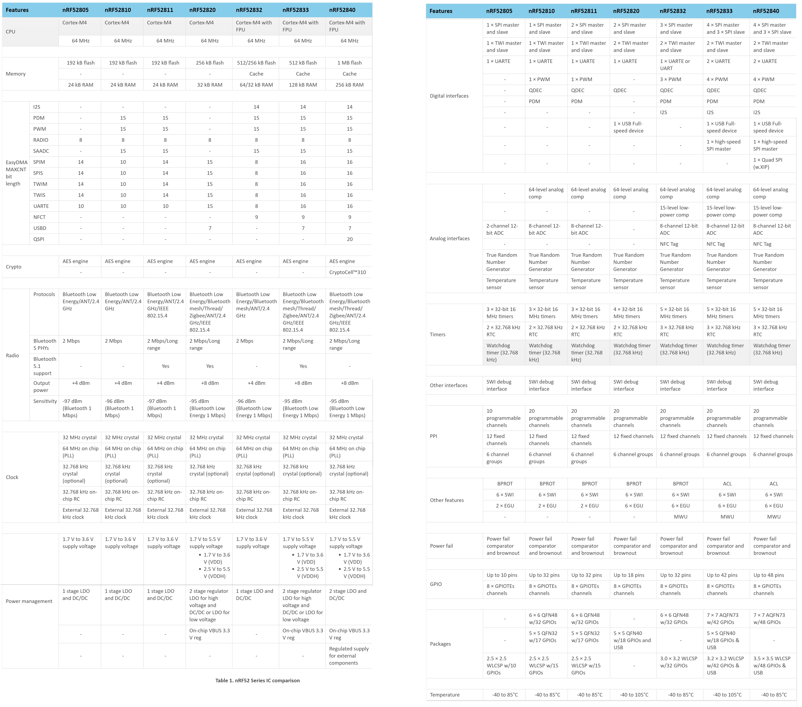

# AIoT__Wireless_2-4G_Bluetooth-BLE-Mesh
AIoT Wireless Module/Platform for Bluetooth(2.4G Hz), BLE, Mesh.  

AIoT Bluetooth(2.4G Hz), BLE, Mesh 无线模块/平台的搭建。

- Nordic 
- Qualcomm 
- Silicon Labs
- TI
- Telink 泰凌

# Nordic Solution

## BLE Solution Comparison Table

|                   | ARM SoC                         | Flash | RAM   | BT Version | Mesh？ | Long  Range | Direction   Finding | Thread？ | Zigbee | ANT  | NFC-A Tag | Other     |
| ----------------- | ------------------------------- | ----- | ----- | ---------- | ------ | ----------- | ------------------- | -------- | ------ | ---- | --------- | --------- |
| nRF5340  2019-11  | Cortex-M33  128/64MHz   FPU,DSP | 1MB   | 512KB | 5.2        | √      | √           | √                   | √        | √      | √    | √         | LE audio  |
| nRF52840  2018-08 | Cortex-M4  64MHz,FPU            | 1MB   | 256KB | 5.0        | √      | √           | ×                   | √        | √      | √    | √         | USB       |
| nRF52833  2019-10 | Cortex-M4  64MHz,FPU            | 512KB | 128KB | 5.2        | √      | √           | √                   | √        | √      | ×    | √         | USB       |
| nRF52820  2020-03 | Cortex-M4  64MHz                | 256KB | 32KB  | 5.2        | √      | √           | √                   | √        | √      | ×    | ×         | USB       |
|                   |                                 |       |       |            |        |             |                     |          |        |      |           |           |
| nRF52805  2020-06 | Cortex-M4  64MHz                | 192KB | 24KB  | 5.2        | ×      | ×           | ×                   | ×        | ×      | ×    | ×         | 不支持USB |
| nRF52811  2019-11 | Cortex-M4  64MHz                | 192KB | 24KB  | 5.2        | ×      | √           | √                   | √        | √      | ×    | ×         | 不支持USB |

## nRF52805

nRF52805 带有具有出色能效 (65 CoreMark/mA) 并且功能强大 (144 CoreMark) 的 64MHz 32 位 Arm®Cortex®-M4 处理器，以及192KB 闪存和 24KB RAM。

其多协议(低功耗蓝牙/2.4GHz)无线电可提供高达 + 4dBm 的功率输出和 -97dBm 灵敏度( 1 Mbps 低功耗蓝牙)，链路预算为 101dBm。

无线电的峰值功率消耗仅为 4.6mA ( TX 0dBM 及 RX 1Mbps)，在保留 24KB RAM和运行 RTC 的情况下，该SoC器件的耗电量在系统关闭状态下低至0.3µA，在系统开启状态下低至1.1µA。

nRF52805 具有一系列模拟和数字接口，例如 SPI、UART和TWI、一个两通道12位ADC和十个GPIO。

Nordic 提供具有全部十个可用 GPIO 的 9.5x8.8mm 参考布局，仅需十个外部无源组件(包括两个晶体负载电容器)。

这款 SoC 器件通过 1.7V 至 3.6V  电源供电，并集成了 LDO 和 DC/DC 电压调节器。

鉴于nRF52805 WLCSP 尺寸仅为 2.48 x 2.46 mm，并且针对双层 PCB 进行了优化，因而可以实现小巧且低成本的设计，这使得设计上必须对二者做出取舍，因为小型设计通常需要价格高出很多的四层 PCB。这使得 nRF52805 WLCSP 成为针对大批量紧凑型无线应用(例如触控笔、演示器、传感器、信标、一次性医疗产品和射频连接器)的理想低功耗蓝牙解决方案。

Nordic 已发布了相关指导文件以指导用户如何在 Nordic 的 nRF5 SDK (软件开发套件)上开发 nRF52805， 然后可以使用 RF52 开发套件(DK) 来仿真 nRF52805，这是在转移至定制开发板之前启动设计的良好硬件基础。

## nRF52833

NRF52811和NRF52833都是蓝牙5.1，软件和硬件都是可以互相兼容的。

## nRF52811

nRF52811支持BLE 5广播扩展包的特性，打破广播包31字节的限制，将广播包长度提升至255字节，极大增加了广播包的数据承载能力，SoC满足更多大数据传输传输应用场景。

# Qualcomm Solution

## CSR1025

# Silicon Labs Solution

# TI Solution

## CC2652R
